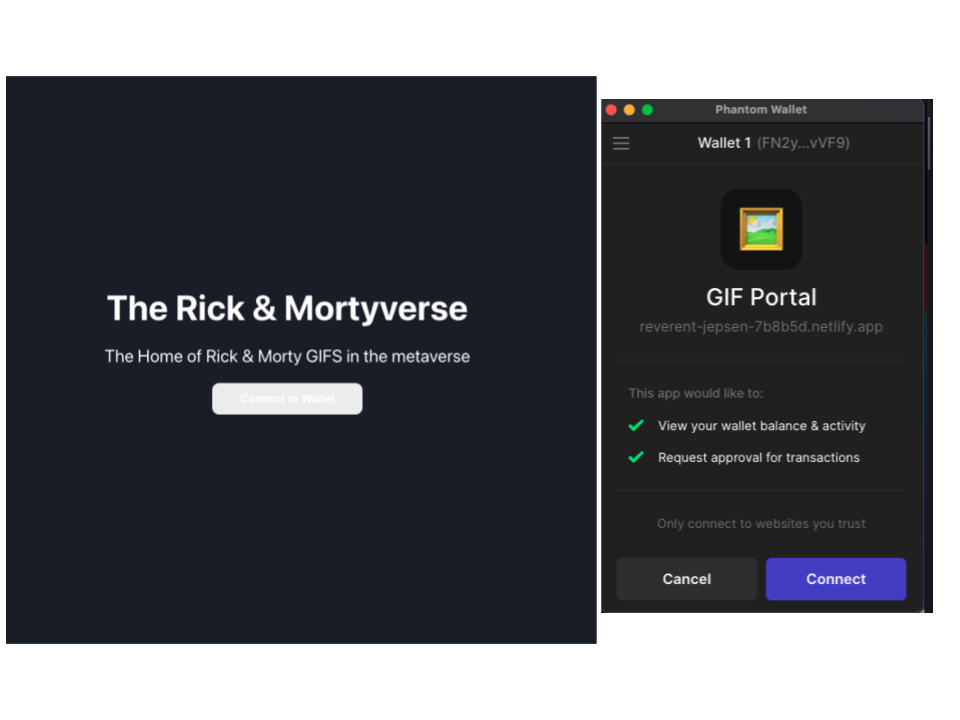
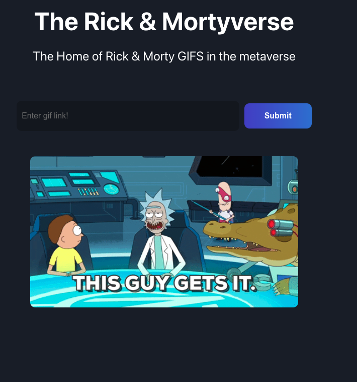
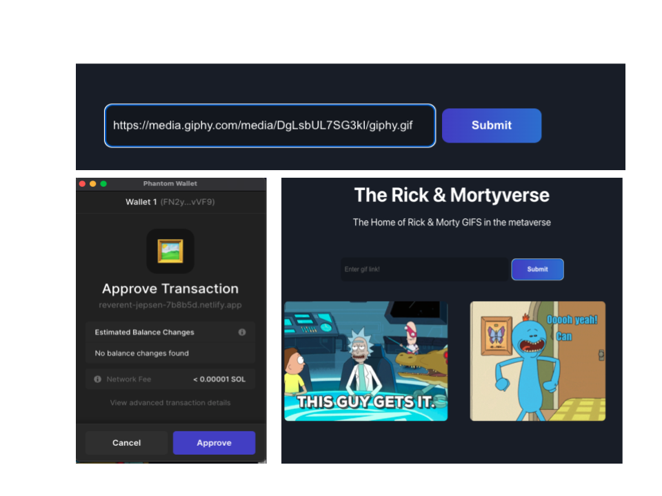

# The Rick & Mortyverse - A Rust/React Solana App 

### Deployed on Netlify [here](https://reverent-jepsen-7b8b5d.netlify.app/)

## Overview
This project was developed as part of Buildspace's Solana GIF Portal Project. The front end for the project is simply a respository for Rick & Morty Gifs. Users can post new Gifs and see the collection, once they authenticate via their Phantom Wallet. The project's main learning goals were to gain an understanding have how key concepts work when building apps on the Solona Blockchain. My own specific learning goals were as follows:

* Learn about how 'Accounts' are created and used to store data on the Solana blockchain
* Learn how authentication might work on web3 apps
* An introduction to the Rust programming language
* Practice Test Driven Development

## Tech Stack 

* Javascript
* Rust
* React.js
* Web3.js
* Anchor 

# App Snapshot 

Users are prompted to connect their Phantom Wallet in order to be authenticated and gain access to the site

Once connected, users have access to the Rick & Morty Gifs

Users can submit new Rick & Morty Gifs to the site. In order to do 
so they must pay for the computing cost in SOL. Once approved, the 
Gif is added to the site.

## Known bugs
The 'connect to wallet' button on the landing page should not be white as it makes the text hard to read (will fix on next re-deploy)

## Development Challenges & Wins
There will several steps in this project that proved very challenging. Firstly, building Solona from source in order to use it on an M1 Mac. Secondly, handling errors 

Certaintly a big win was understanding how authentication can be handled on the blockchain, the process was streamlined and fairly straightfoward to implement.  

## Future Goals

